# Kronos-small `small_0.1` 模型与训练技术报告

## 1. 摘要与范围

本文记录 Kronos-small `small_0.1` 从 `small_0.1_bootstrap_timing` 初始化、经 `small_0.1_main` 主训练、`small_0.1_stage2_extend_01` 增训、两轮 Warmup-Constant 训练，到 `small_0.1_stage2_cosine_refinement` 退火收口的模型设计、数据处理、优化配置和实测结果。报告面向论文撰写，优先记录可由代码和训练日志复核的事实。

`small_0.1_stage2_wc_last` 是从 Extend 01 后继续进行的 Warmup-Constant 训练，本轮已完成 534/534 个 segments；其后的 `small_0.1_stage2_wc_dual_t4` continuation 也已完成 534/534 segments，随后进行的 `small_0.1_stage2_cosine_refinement` 退火训练完成 267/267 segments。三者均作为独立阶段记录，不混合不同 scheduler 的结果。

## 2. 版本血缘与研究目标

研究目标是在保持 Kronos-small 预训练时序建模能力的基础上，引入 A 股市场的股票行业、市值和时间条件，并使用严格的时间/股票隔离验证方案进行全参数微调。版本关系如下：


Bootstrap 从预训练底座开始，以双学习率完成条件化初始化；Main 继承 Bootstrap 的 `best_model`，切换为统一学习率并完成一轮主训练；Extend 01 再继承 Main 的 `last_model`，使用不同窗口排列进行续训；WC first round 继承 Extend 01 C2 的 `last_model`，改用 Warmup-Constant；WC dual T4 再从上一轮 WC checkpoint 连续训练一轮完整 coverage；Cosine refinement 最后从 WC dual T4 的 checkpoint 退火收口。六者是串行训练血缘，不是从底座出发的并列实验。

## 3. 模型架构

### 3.1 预训练底座

- 模型：`NeoQuasar/Kronos-small`
- tokenizer：`NeoQuasar/Kronos-Tokenizer-base`
- Transformer 层数：8
- `d_model=512`
- attention heads：8
- feed-forward hidden dimension：1024
- 原始模型规模约 24.7M；加入条件模块后的 predictor 可训练参数为 24,819,392（日志显示 100% 可训练，约 24.8M）。

本项目没有物理新增两层 Transformer。条件信息通过 `context_layer=6` 在第 6 层位置注入，因此条件信息会被后续两层继续处理；这应表述为“中间层条件注入”，而不是“增加两层”。

### 3.1.1 模型结构图

可以把底座模型理解为“把一段历史价格压缩成 token，再用 Transformer 预测下一个 token”的通用时序模型。`small_0.1` 保留这条主干，只在输入和中间层增加股票静态信息，并保留原有的双 token 预测头：

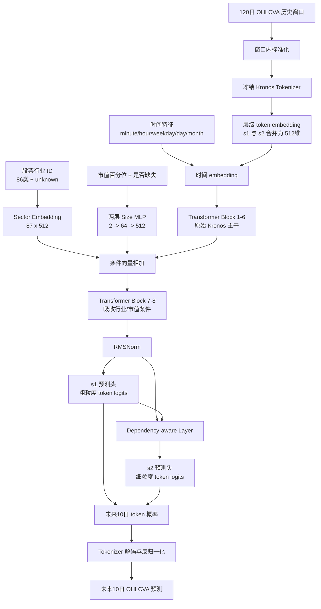

图中“新增”的部分只有三类：

1. **行业条件**：行业 ID 经过一个 512 维 embedding，得到一条代表行业的向量。
2. **市值条件**：市值百分位和缺失标记经过 `2 -> 64 -> 512` 的 MLP，得到一条代表规模的向量。
3. **条件注入位置**：行业向量与市值向量相加后，加到第 6 个 Transformer block 之后的每个时间步，因此最后两个 block 可以利用这些静态信息。

这些条件模块的输出层在初始化时置零，所以刚加载底座时，新增分支近似“不改变原模型”；训练过程中它们再逐渐学习行业和市值的影响。训练日志显示新增条件参数约 78,016 个，主干及原有预测路径仍占绝大多数参数；因此“24.8M 模型”不是一个从零设计的新网络，而是 Kronos-small 主干加小规模条件适配模块。

### 3.1.2 底座与改造后网络对照

| 组件 | 原始 Kronos-small | `small_0.1` 改造后 |
|---|---|---|
| 连续输入 | OHLCVA，经 tokenizer 转 token | 相同；额外使用时间和股票元数据 |
| Transformer 主干 | 8 blocks，512 hidden，8 heads，FFN 1024 | 完整保留，8 blocks 均可训练 |
| 时间信息 | temporal embedding | 保留并继续相加到 token embedding |
| 行业信息 | 无 | 87 类 sector embedding，输出 512 维 |
| 市值信息 | 无 | percentile + known flag，经 `2->64->512` MLP |
| 条件注入 | 无 | 第 6 层后注入，影响最后 2 个 blocks |
| 输出 | s1/s2 双 token 预测 | 保留原输出头；本实验未启用 return/barrier auxiliary head |
| 参数更新 | 预训练时更新 | 微调时 24,819,392/24,819,392（100%）更新 |

这里的“最后两个 blocks 吸收条件”是信息流位置描述，不代表前六个 blocks 被冻结；三段正式训练日志都报告全部 predictor 参数可训练。

**参数统计注记：** 表中的 100% 仅指 Predictor 主干及条件模块；Kronos Tokenizer 在数据预处理阶段作为静态映射字典完全冻结，不计入 Predictor 的梯度图与可训练参数总量。

### 3.2 输入与条件分支

每个样本由 120 日历史窗口和未来 10 日预测窗口组成。六个连续市场特征为 `open/high/low/close/volume/amount`；时间戳特征包括 minute、hour、weekday、day、month。股票行业使用 86 个行业类别及 unknown 类别。市值不使用离散 bucket，而使用 `[size_percentile, is_known]` 输入的两层 MLP。

条件分支输出层采用零初始化，使模型刚接入条件时近似保持预训练模型的输出，降低突然改变预训练分布的风险。`return_head` 和 `barrier_head` 仅在 Beta v2.1 auxiliary 配置开启时创建；本报告覆盖的 Bootstrap、Main 和 Extend 01 日志均未启用该 auxiliary objective。

### 3.3 预测路径

历史 OHLCVA 经 tokenizer 编码为离散 token，Transformer 对历史及 teacher-forcing 序列进行预测；训练目标是未来 10 日 token 的交叉熵，同时保留历史 token 的辅助重建损失。推理阶段使用自回归生成，并将归一化空间的输出还原到原始量纲。

## 4. 数据窗口、隔离与归一化

### 4.1 窗口构造

`QlibDataset` 每个窗口包含 `120 + 10 + 1 = 131` 行：120 行 lookback、10 行 forecast，以及用于边界/时间对齐的额外行。训练数据共 10,661,560 个可用窗口，每个 segment 无放回抽取 20,000 个窗口，因此一轮完整 coverage 为 534 segments。

验证不是从全市场所有股票中随机抽窗口。数据首先按行业、市值分位和历史长度等分层，从源股票池中固定抽取 **520 只验证股票**；另有 4,678 只股票作为主要训练股票。随后对这 520 只验证股票做时间切分：2024-12-31 及以前的历史可留在训练侧，2025-01-01 起的数据只进入验证侧。因此这是“股票 cohort + 时间”的隔离，而不是简单的全股票随机窗口切分。

由于部分验证股票在有效日期范围内不足以构成完整的 120 日 lookback + 10 日 forecast 窗口，最终实际进入验证窗口池的是 **516 只股票**。因此 manifest 中的 `val_data.pkl` 仍有 520 只股票，但候选窗口身份只覆盖 516 只。时间切分后，训练面板统计为 5,189 只股票（4,678 只主要训练股票，加上 520 只验证股票在 2024-12-31 以前仍保留的历史部分）；验证面板为 520 只股票，训练和验证的有效窗口不重叠。这 516 只有效验证股票在 2025-07-03 至 2026-07-02 的 242 个 signal dates 上产生 123,836 个候选验证窗口。为了快速完成 Bootstrap 初始化，Bootstrap 使用其中按方向、月份、行业和市值分层抽取的 19,998 个固定验证窗口；Main 和 Extend 01 才使用这 123,836 个候选窗口的全量。Extend 01 日志明确记录 `replay_samples=0`。

4 只未形成窗口的验证股票是自然数据长度不足，而非人工按结果淘汰：`sh.603352`（121 行）、`sh.688811`（67 行）、`sz.301669`（28 行）和 `sz.301680`（91 行）均不足以构成最小 131 行样本。它们保留在验证股票清单中，但不出现在有效窗口身份集合中。

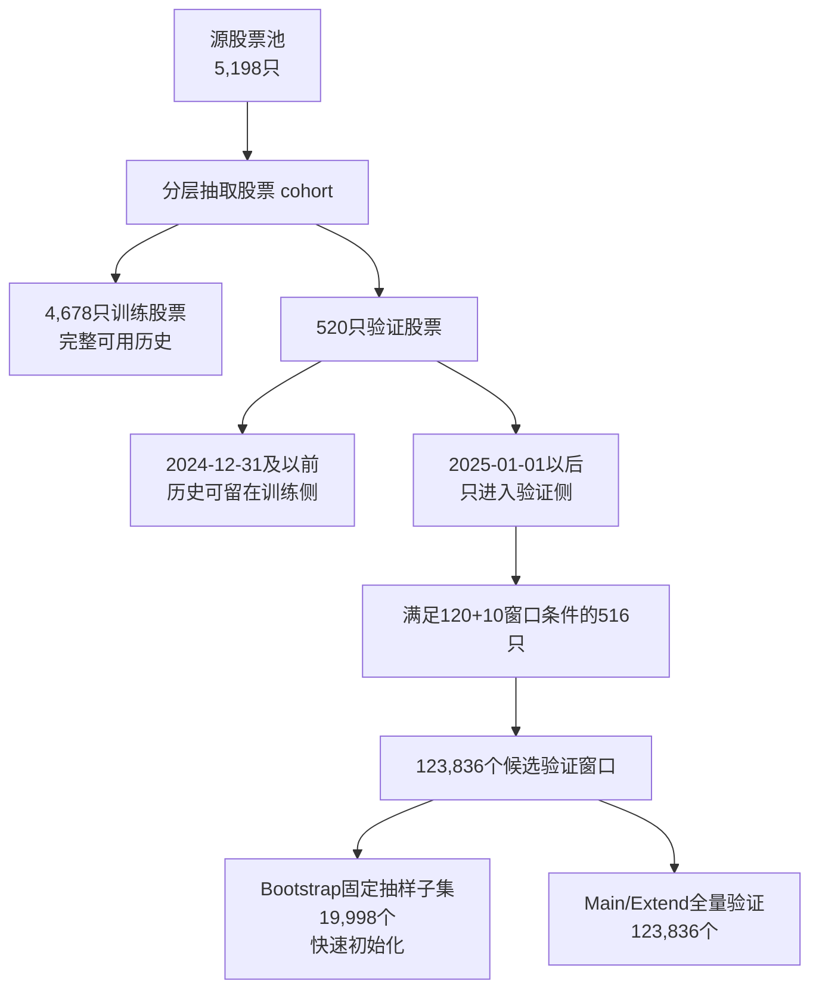


上图表达的是同一批验证股票的时间角色，而不是把 520 只股票误认为全市场。2025 年上半年的记录可以出现在验证窗口的历史输入中，但不能形成训练样本；OOS 数据既不训练，也不参与 best checkpoint 选择。验证 cohort 的固定股票清单来自 `symbol_split.csv`，窗口级 19,998 子集另有独立 manifest 和样本身份哈希。

验证窗口之间允许自然的滚动重叠：同一股票相邻 signal dates 的 120 日 lookback 通常共享约 119 日历史。因此 123,836 是窗口数量，不应被解释为 123,836 个 IID 独立观测；它适合估计验证期平均 NLL，但显著性分析应按 signal date、股票或 block bootstrap 估计有效样本量。

### 4.2 窗口内标准化

对每个样本，只使用 lookback 的 120 行计算每个 OHLCVA 列的均值和标准差，并将同一组统计量应用于未来 10 日：

\[
x' = \operatorname{clip}\left(\frac{x-\mu_{1:120}}{\sigma_{1:120}+10^{-5}},-5,5\right).
\]

因此未来目标不会参与标准化统计，避免信息泄漏。时间特征、行业 ID 和市值百分位不进行上述 OHLCVA Z-score；归一化后的连续序列再交给冻结 tokenizer 编码。

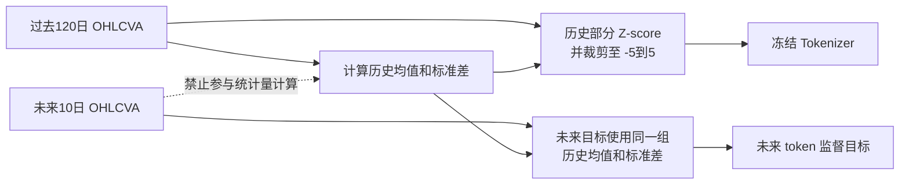

### 4.3 coverage 顺序与可复现性

Dataset 初始化时以固定 seed 生成 `coverage_order`，DataLoader 使用 `shuffle=False`。一轮 coverage 中每个窗口原则上恰好出现一次；启用均衡策略时先在 bucket 内打乱，再交错分配并打乱 segment 内顺序。不同训练阶段可以使用不同 `coverage_seed`：Bootstrap/Main 使用默认 seed `100`，Extend 01 使用 `20260907`，Warmup-Constant 使用 `20260908`。因此新阶段会重新排列同一批训练窗口，但不会改变训练数据集合。

## 5. 损失函数与模型选择

对 history 和 forecast 分别计算 token-level NLL。未来 10 个 horizon 的 forecast loss 使用配置权重：

```text
1.364, 1.364, 1.364, 1.136, 1.136,
0.909, 0.909, 0.682, 0.682, 0.455
```

代码会先将 horizon 权重归一化。训练目标为：

\[
L = L_{forecast}^{weighted} + 0.02 L_{history}.
\]

checkpoint 的 best 选择指标是 `forecast`。日志中的 `Validation Forecast` 是未加 horizon 权重的原始 forecast NLL 汇总值；不能把该打印值误称为 weighted forecast objective。本文正式范围没有加入 Beta v2.1 的 return/barrier auxiliary loss。

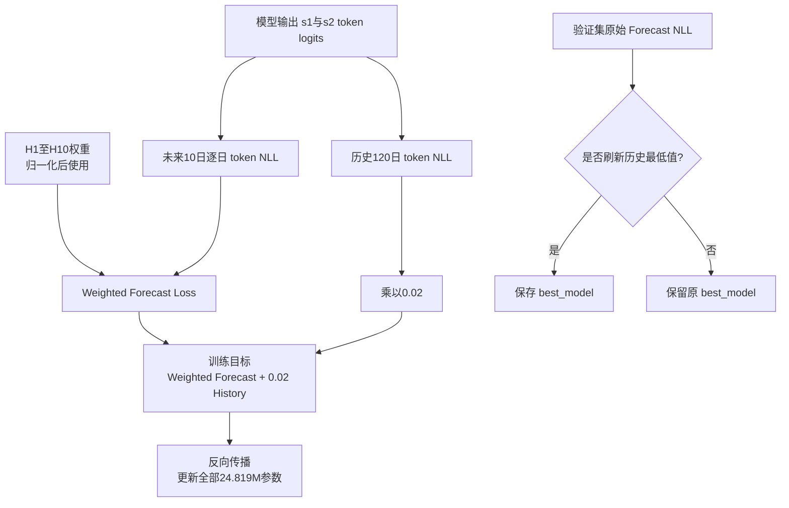

## 6. 五个正式训练阶段

| 阶段 | 初始化 | batch | 学习率 | scheduler | 验证 | 结果 |
|---|---|---:|---|---|---:|---|
| Bootstrap | Kronos-small 底座 | 32 | adaptation/backbone `1e-6`；condition `1e-5` | 1% warm-up + cosine | 19,998 固定抽样窗口 | 534/534 segments；forecast 约 2.8758 -> 2.6287；最佳约 segment 516 |
| Main | Bootstrap `best_model` | 64 | backbone 与 condition 统一峰值 `1e-5`，warm-up 起点 `1e-6` | 1% warm-up + cosine | 123,836 | 534/534；forecast 2.638442 -> 2.505295；最佳 segment 528，2.505244 |
| Extend 01 | Main 的 `last_model` | 64 | 统一峰值 `1e-5`，fresh optimizer | 1% warm-up + cosine | 123,836 | 新 seed；完成 190/534；forecast 2.505623 -> 2.437912 |
| WC first round | Extend 01 C2 的 `last_model` | 64 | warm-up 后统一保持 `1e-5`，fresh optimizer | 1% warm-up + constant | 123,836 | seed=20260908；完成 534/534；forecast 2.437121 -> 最佳 2.353069，末段 2.354255 |
| WC dual T4 | WC first round `last_model` | 32/GPU × 2，global 64 | warm-up 后统一保持 `1e-5`，fresh optimizer | 1% warm-up + constant | 123,836 | seed=20260910；完成 534/534；forecast 2.355044 -> 最佳 2.304162，末段 2.306788 |
| Cosine refinement | WC dual T4 checkpoint | 64 | 统一 LR 从约 `1e-5` 退火至约 `1e-6` | uniform cosine，无 warm-up | 123,836 | seed=20260912；完成 267/267；forecast 2.306393 -> 最佳 2.294402，末段 2.295665 |

Bootstrap 的双学习率只用于启动阶段：条件分支以较快速度适应，而主干以较小步长保持预训练能力。Main 将两类参数统一到同一峰值学习率，作为正式全参数微调。Extend 01 不改变目标函数和验证集，只改变续训起点及 coverage 顺序。WC first round 在此基础上还改变 scheduler，但仍保持相同 batch、loss、数据集合和全量验证定义。WC dual T4 保持 Warmup-Constant 训练定义不变，只将执行方式改为双 T4 DDP；每卡 batch 32、global batch 64，因此优化器每步看到的总样本量没有改变。

#### Main、Extend 01 与两轮 WC 的日志串联

下图展示 Stage 2 的四次连续训练。箭头表示实际的 checkpoint 继承关系；色块表示训练阶段，而不是并列的独立实验。四次训练均更新全部 24,819,392 个 predictor 参数，验证集均为全量 123,836 个窗口。

```mermaid
flowchart LR
    MB[Main last_model<br/>534/534 segments<br/>forecast 2.505295<br/>global step 166,854]
    M[Stage 2 Main<br/>warm-up + cosine<br/>统一峰值 LR = 1e-5<br/>warm-up 起点 = 1e-6<br/>batch = 64]
    ML[Main best_model<br/>forecast 2.505244<br/>约 segment 528]

    EB[Extend 01 输入<br/>继承 Main last_model]
    E[Stage 2 Extend 01<br/>warm-up + cosine<br/>统一峰值 LR = 1e-5<br/>coverage seed = 20260907<br/>batch = 64]
    EL[Extend 01 last_model<br/>190/534 segments<br/>forecast 2.437912]

    WB[WC 输入<br/>继承 Extend 01 C2 last_model]
    W[Stage 2 WC first round<br/>warm-up + constant<br/>warm-up 后恒定 LR = 1e-5<br/>warm-up 起点 = 1e-6<br/>coverage seed = 20260908<br/>batch = 64]
    WL[WC last_model<br/>534/534 segments<br/>forecast 2.354255]
    WBest[WC best_model<br/>约 segment 527<br/>forecast 2.353069]

    W2[Stage 2 WC dual T4<br/>warm-up + constant<br/>恒定 LR = 1e-5<br/>2×T4，global batch = 64]
    W2L[WC dual T4 last_model<br/>534/534 segments<br/>forecast 2.306788]
    W2B[WC dual T4 best_model<br/>segment 512<br/>forecast 2.304162]

    MB --> M --> ML
    M --> EB --> E --> EL
    EL --> WB --> W --> WL
    W --> WBest
    WL --> W2 --> W2L
    W2 --> W2B

    classDef main fill:#dbeafe,stroke:#2563eb,color:#111827,stroke-width:2px;
    classDef extend fill:#dcfce7,stroke:#16a34a,color:#111827,stroke-width:2px;
    classDef wc fill:#fef3c7,stroke:#d97706,color:#111827,stroke-width:2px;
    classDef wc2 fill:#f3e8ff,stroke:#7c3aed,color:#111827,stroke-width:2px;
    classDef checkpoint fill:#f3f4f6,stroke:#6b7280,color:#111827;
    class M,MB,ML main;
    class E,EB,EL extend;
    class W,WB,WL,WBest wc;
    class W2,W2L,W2B wc2;
```

图中 `Main` 与 `Extend 01` 的 cosine 训练都使用统一峰值 `1e-5`；WC first round 将 scheduler 改为 warm-up 后恒定 `1e-5`，并使用新的 coverage seed。由于 Extend 01 的日志只完成 190/534 个 segments，WC 的实际输入标注为 Extend 01 C2 的 `last_model`，不能把 Extend 01 的中间日志末点误写成 WC 的初始化 checkpoint。

对应的 segment-level 全量验证损失如下。横轴将五份日志按实际训练顺序连续拼接：Main 为 1--534，Extend 01 为 535--724，WC first round 为 725--1258，WC dual T4 为 1259--1792，Cosine refinement 为 1793--2059；虚线为阶段边界，背景色与上图血缘图一致。

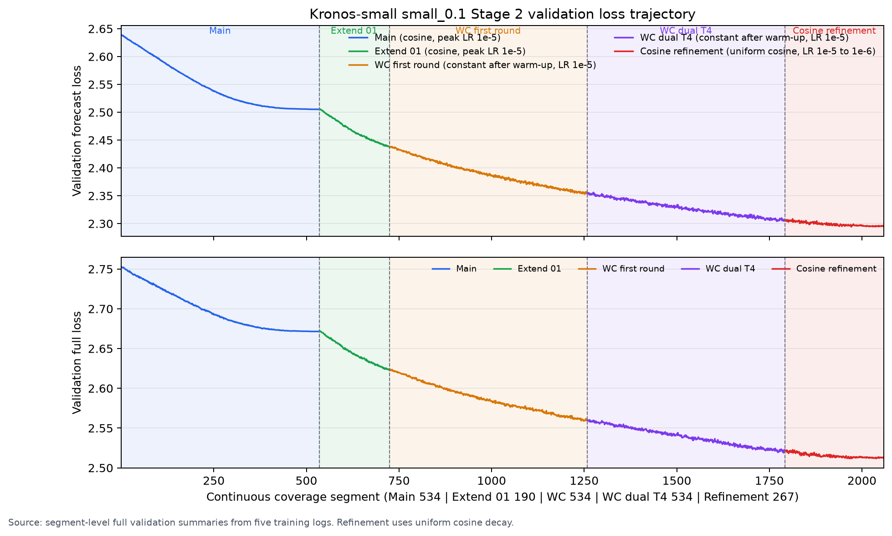

图中可以直接看到：Main 和 Extend 01 均为 warm-up + cosine、峰值学习率 `1e-5`；两轮 WC 为 warm-up 后恒定 `1e-5`；Cosine refinement 再将统一学习率从约 `1e-5` 退火至约 `1e-6`。退火阶段完成 267/267 segments，forecast 从 `2.306393` 降至最佳 `2.294402`。该图描述的是验证轨迹，不构成控制变量意义上的 scheduler 因果比较，因为各 continuation 阶段同时使用了新的 coverage seed。

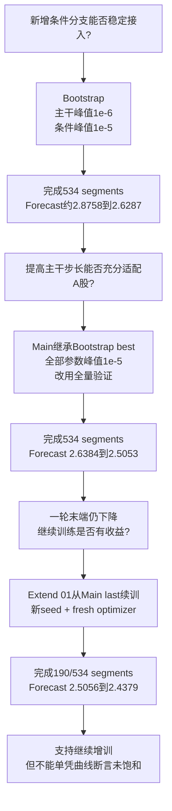

所有阶段都训练完整网络，差异是学习率和初始化起点，而不是是否冻结主干：

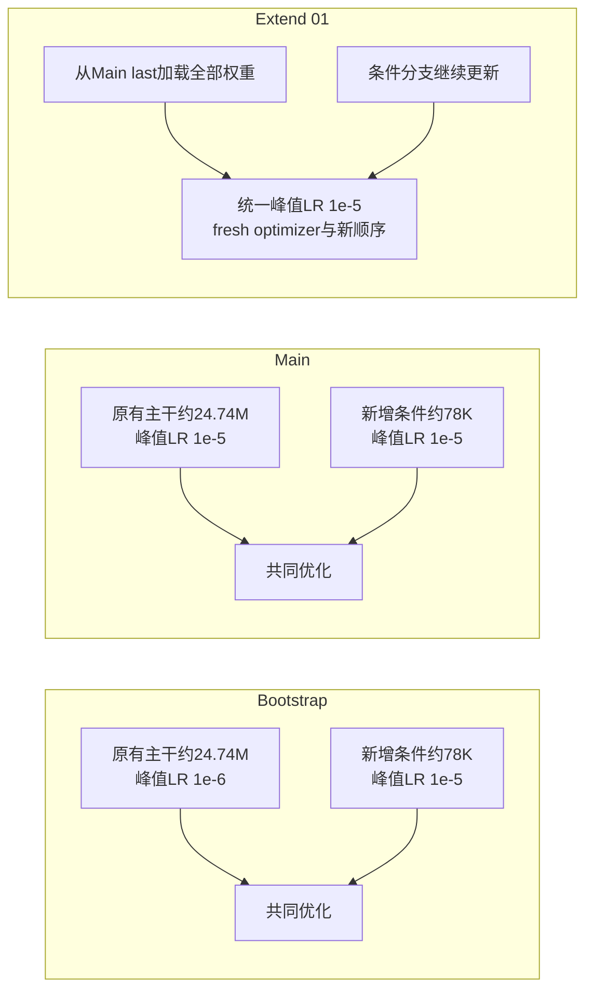

### 6.1 第一次训练：Bootstrap 初始化

#### 为什么需要 Bootstrap

直接把刚加入的行业、市值条件分支和 24.7M 预训练主干同时用同一个较大学习率更新，存在破坏底座输出分布的风险。因此 Bootstrap 被设计成一次“稳定启动”：让新增条件分支先获得可用梯度，同时让预训练主干以更保守的步长适应 A 股数据。这里的目标不是宣称 Bootstrap 已经得到最终模型，而是验证条件接入、归一化、tokenizer、loss 和 Kaggle 接力流程能够稳定工作。

#### 具体参数与数据

- 初始化：`NeoQuasar/Kronos-small`；行业 embedding 和市值 percentile MLP 的输出层重置为零，使新增条件初始近似 no-op。
- 可训练参数：24,819,392/24,819,392（100%），没有冻结 Transformer 主干。
- lookback/forecast：120/10 日；batch size 32；AMP float16，tokenizer 编码保持 float32。
- 训练集：10,661,560 个窗口；每 segment 20,000 个唯一窗口；完整 coverage 534 segments。
- 验证集：固定 manifest 的 19,998 个窗口（从可用的 123,836 个验证窗口中抽取），其中 2025H2 为 9,820、2026H1 为 10,178。
- 优化器学习率：主干/原有 adaptation 参数峰值 `1e-6`，条件参数峰值 `1e-5`；两者 warm-up 起点分别为 `1e-7` 和 `1e-6`。
- scheduler：warm-up 占全局计划的 1%，随后 cosine 衰减；loss 为 `weighted forecast + 0.02 * history`；best 按 forecast 选择。

Bootstrap 最终完成 534/534 segments。固定验证 forecast 从首段约 2.8758 降到末段约 2.6287，最佳约出现在 segment 516（约 2.628729）。这证明模型和条件分支能够稳定训练，但由于主干学习率较低且验证集是固定子集，该阶段结果主要承担初始化和管线验证职责。

### 6.2 第二次训练：Stage 2 Main

#### 与 Bootstrap 的差异

Main 从 Bootstrap 的 `best_model` 继续，而不是从原始 Kronos-small 重新开始。运行脚本明确查找 Bootstrap best 的 `model.safetensors`，并记录 `selection=bootstrap_best`。进入 Main 时只继承模型权重，创建新的 optimizer 和全局学习率计划；Main 与 Bootstrap 默认使用同一个 coverage seed=100，因此并不是通过换 seed 产生新的训练窗口顺序。Main 的作用是让已经完成条件化初始化的模型进入统一学习率主训练，而不是一个与 Bootstrap 相互独立的对照实验。核心改变有三点：

1. backbone/adaptation 与 condition 使用相同的峰值学习率 `1e-5`，不再让主干长期处于 `1e-6` 的保守步长；
2. batch size 从 32 提升到 64，以提高吞吐并降低单个 segment 的执行时间；
3. 验证由 19,998 个固定抽样窗口改为全量 123,836 个窗口，覆盖验证期内全部可用 segment。

#### 具体参数与数据

- 初始化：Bootstrap `best_model`（约 segment 516）；只载入模型权重，并为 Main 建立新的 optimizer/scheduler；24,819,392 个 predictor 参数全部更新。
- lookback/forecast：120/10 日；batch size 64；AMP float16。
- 训练集：10,661,560 个窗口，20,000/segment，534 segments，完整一轮 coverage。
- 验证集：123,836 个窗口，signal 日期 2025-07-03 至 2026-07-02，共 242 天；无 replay 样本。
- 学习率：backbone 和 condition 的 warm-up 起点均 `1e-6`，峰值均 `1e-5`；warm-up ratio 1%。
- scheduler、loss、horizon 权重和 best 指标与 Bootstrap 保持一致，以便比较时主要改变训练动力学和验证覆盖，而不是改变任务定义。

#### 训练表现

Main 完成 534/534 segments。全量验证 forecast 从 segment 1 的 2.638442 降至 segment 534 的 2.505295，最佳 checkpoint 出现在约 segment 528，forecast 为 2.505244。全量验证比 Bootstrap 的固定抽样更慢，但给出的指标覆盖完整验证窗口，因此作为 `small_0.1` 的主要 Stage 2 基准。

这里存在一个必须保留的实验限制：Bootstrap best 是在 19,998 个固定抽样窗口上选择的，Main 则从该 checkpoint 开始，在 123,836 个全量窗口上继续训练。因此 Bootstrap 的 `best` 只表示抽样子集意义下的最优，不能直接与 Main 的全量 forecast 数值比较。Bootstrap best 与 last 在抽样集上的 forecast 分别约为 `2.628663` 和 `2.628686`，差异约 `0.000023`；但两者在同一 123,836 全量验证集上的对照尚未执行，后续应补充该诊断以检验子集选模的稳定性。

新阶段重新排列训练窗口后，验证 loss 仍会在上一阶段末端附近衔接，因为模型权重是连续继承的：Main 的 Segment 1 在加载 Bootstrap best 权重后开始；Extend 01 的 Segment 1 在加载 Main last 权重后开始，因此 Extend 01 的起始 forecast 约 2.5056，与 Main 末段约 2.5053 同量级。Extend 01 的新 seed 只改变后续训练窗口的访问顺序，不改变模型初始化；同理，Warmup-Constant 继承前一阶段 checkpoint 后，即使使用新的窗口排列和 scheduler，起始验证 loss 也应与上一阶段末端相近，随后才沿新的优化轨迹发展。

### 6.3 第三次训练：Stage 2 Extend 01

#### 为什么增加 Extend 01

Main 完整覆盖一轮后，验证 forecast 仍在下降，且最佳点位于末段附近，日志没有显示明确平台。这个现象提供了“当前模型可能仍能从新窗口组合中继续学习”的经验信号，但不能单独证明模型已经或尚未达到容量上限。因此 Extend 01 的定位是**受控增训实验**：从 Main 的 `last_model` 续训，在不改变数据、loss 和验证定义的情况下，仅更换窗口访问顺序，观察改善是否能够持续。

#### 具体参数与数据

- 初始化：Stage 2 Main 的 `last_model`；重新创建 fresh optimizer，避免沿用上一轮 optimizer 动量状态。
- coverage seed：`20260907`，不同于 Main 的 seed=100；窗口集合不变，排列改变。
- 可训练参数：24,819,392/24,819,392（100%）。
- batch size 64；统一峰值学习率 `1e-5`；warm-up ratio 1%；scheduler 仍为 warm-up cosine。
- 训练数据：同一 10,661,560 个训练窗口，每 segment 20,000 个窗口；本次只完成 190/534 segments，属于中间状态，不是完整第二轮 coverage。
- 验证数据：保持全量 123,836 个窗口，`replay_samples=0`，验证日期仍为 2025-07-03 至 2026-07-02。

#### 训练表现与结论边界

Extend 01 的 forecast 从 segment 1 的 2.505623 降至 segment 190 的 2.437912，190 个 segment 内持续改善。这个结果支持“在新的 coverage 顺序和相同任务定义下仍有可学习增益”的判断，因此值得继续训练；但因为只完成 190/534，不能把它和 Main 的完整 coverage 做成严格的最终优劣比较，也不能据此断言模型一定没有吃饱。后续应完成相同 coverage 计划，或使用固定计算预算进行可比实验。

### 6.4 第四次训练：Stage 2 Warmup-Constant first round

#### 实验动机与设置

Extend 01 C2 结束后，模型的全量验证 forecast 仍在下降，cosine 学习率则会随预设 global step 逐步衰减。为区分“真实平台期”和“步长衰减造成的表观放缓”，本轮从 Extend 01 C2 的 `last_model` 继续训练，将 scheduler 改为 warm-up 后恒定学习率。该设计只改变优化器的学习率轨迹；模型结构、loss、batch、训练窗口集合和验证定义保持不变。

- checkpoint 起点：Extend 01 C2 的 `last_model`；重新创建 fresh optimizer。
- coverage seed：`20260908`，与之前阶段不同；窗口集合仍为同一批 10,661,560 个训练窗口，仅访问顺序重新排列。
- 模型参数：24,819,392/24,819,392（100%）可训练。
- batch size：64；AMP 为 float16，tokenizer 编码保持 float32。
- loss：`forecast` 模式，训练目标仍为 weighted forecast loss + `0.02 * history loss`；验证选择指标为原始 forecast NLL。
- scheduler：`warmup_constant`；warm-up ratio 1%，起点 `1e-6`，达到 `1e-5` 后保持不变；global plan 为 166,854 steps，其中 1,669 steps warm-up。
- 训练覆盖：每 segment 20,000 个窗口，共 534 个 segments；本轮完成 534/534。
- 验证：全量 123,836 个窗口，验证期 2025-07-03 至 2026-07-02（242 个 signal dates）。

#### 训练结果

| 指标 | Segment 1 | 本轮最佳（约 Segment 527） | Segment 534 / last |
|---|---:|---:|---:|
| Validation forecast | 2.437121 | **2.353069** | 2.354255 |
| Validation history | 2.640016 | 未单独记录 | 2.578719 |
| Validation full | 2.622678 | 未单独记录 | 2.559669 |

本轮总耗时约 2 小时 18 分钟。末段 forecast 比历史最佳高约 0.00119，说明最后几个 segment 未刷新 best，但仍处于同一低值区间；这属于末段小幅波动，不能称为明确反弹。与 Extend 01 末端约 Segment 190 的 forecast `2.437912` 相比，WC Segment 1 为 `2.437121`，起点在连续继承权重后正常衔接；随后完整一轮继续下降至最佳 `2.353069`。

#### 解释边界

结果表明，warm-up 后恒定 `1e-5` 在完整一轮内没有发散，并且全量验证指标继续改善；截至本轮结束，loss 尚未进入可确认的平台期。因此下一轮 continuation 具有继续观测的价值。但本轮同时使用了新的 coverage seed，不能把结果解释为纯粹的 cosine/constant scheduler A/B，也不能仅凭持续下降断言模型“没有吃饱”。严格结论仍需在相同起点、相同 seed 和相同预算下比较两种 scheduler，并结合 OOS 指标。

### 6.5 第五次训练：Stage 2 WC dual T4

#### 为什么继续第二轮 Warmup-Constant

WC first round 完成时，最佳 forecast 出现在约 segment 527，且末端只比最佳值高约 0.00119，没有形成持续横盘或系统性反弹。因而第二轮的研究问题不是重复证明训练可以运行，而是检验：在统一 `1e-5` 不衰减的条件下，再完整覆盖一次重新排列的训练窗口，验证 loss 是否仍能获得可复核的增益。该阶段沿用相同模型、目标函数、训练集和验证集，计算平台改为双 T4 DDP，以提高单位时间吞吐。

#### 实验设置

- 初始化：继承 WC first round 的 `last_model`；模型权重连续，因此 segment 1 的 forecast `2.355044` 与上一轮 last `2.354255` 正常衔接。
- coverage seed：正式 coverage 使用 `20260910`。日志中还出现一次 seed `20260911` 的启动尝试，但该尝试未形成纳入连续 coverage 的有效 segment；最终记录的 534 个 segment 按 1--534 连续且无缺号。
- 硬件与并行：2×NVIDIA T4，PyTorch DDP/NCCL；每卡 batch 32，global batch 64，与上一阶段的有效 batch size 相同。
- 模型参数：24,819,392/24,819,392（100%）可训练；tokenizer 仍冻结并以 float32 编码。
- 混合精度：predictor 使用 float16 AMP 和 gradient scaling。
- loss：`forecast` 模式，history weight `0.02`；best checkpoint 继续按原始 validation forecast NLL 选择。
- scheduler：`warmup_constant`；global plan 166,854 optimizer steps，1% warm-up（1,669 steps），从 `1e-6` 升至 `1e-5` 后保持恒定。
- 数据：10,661,560 个训练窗口，每 segment 20,000 个窗口，共 534/534 segments；验证仍为固定的全量 123,836 个窗口、242 个 signal dates。
- 日志中各 segment 的训练与验证耗时合计约 27.47 小时；该值为跨 Kaggle invocation 的 segment 时间求和，不等于任意单个 Kernel 的连续运行时长。

#### 完整训练结果

| 指标 | Segment 1 | 本轮最佳（Segment 512） | Segment 534 / last |
|---|---:|---:|---:|
| Validation forecast | 2.355044 | **2.304162** | 2.306788 |
| Validation history | 2.578852 | 2.541234 | 2.541959 |
| Validation full | 2.559856 | 2.521239 | 2.522110 |

从本轮起点到最佳点，forecast loss 下降 `0.050882`，相对下降约 2.16%；到 last 的净下降为 `0.048256`，相对下降约 2.05%。最佳点出现在完整 coverage 的后段，segment 534 比最佳点高 `0.002626`。因此，该轮再次证明恒定 `1e-5` 仍能在新的完整 coverage 中继续降低固定验证集 loss；同时，末段围绕最佳值波动加大，提示继续维持同一学习率的边际收益正在减弱。

#### 阶段结论与退火依据

WC dual T4 的完成将证据从“第一轮 constant 仍下降”推进到“第二轮 constant 仍有收益，但末段开始在低值附近波动”。这仍不能证明模型达到容量上限，也不能单独证明 Constant 优于 Cosine，但已足以支持从探索阶段转入**退火阶段**：降低学习率，在保留当前表征的前提下减小参数更新噪声，检验能否获得低于 `2.304162` 的稳定验证最优值。

退火必须作为新的独立阶段记录，不回写 WC dual T4 的结果。实验开始前同时封存 WC dual T4 的 `best_model` 与 `last_model`；若选择其中一个作为退火起点，论文必须明确记录选择规则。除 scheduler/学习率外，应保持模型结构、loss、global batch 64、训练窗口集合、全量验证集和 best 选择指标不变，以便把后续变化主要归因于学习率收口。

### 6.6 第六次训练：Cosine refinement 退火

#### 实验设置

Cosine refinement 从 WC dual T4 的连续 checkpoint 开始，目标是检验降低学习率后能否在当前低损失区域进一步收口。该轮使用新的 coverage seed `20260912`，保持 global batch 64、全量验证集和 forecast best 选择规则不变。日志记录的 scheduler 为 `uniform_cosine`，无额外 warm-up；统一学习率从约 `1e-5` 逐步退火到约 `1e-6`。global learning-rate plan 为 83,571 steps，warm-up 为 0 steps。

本轮完成 `267/267 segments`，每 segment 20,000 个训练窗口；训练集合仍为 10,661,560 个窗口，验证集合仍为 123,836 个窗口。24,819,392 个 predictor 参数全部参与优化，tokenizer 继续冻结。

#### 训练结果

| 指标 | Segment 1 | 本轮最佳（Segment 179） | Segment 267 / last |
|---|---:|---:|---:|
| Validation forecast | 2.306393 | **2.294402** | 2.295665 |
| Validation history | 2.5416 | 2.5318 | 2.5332 |
| Validation full | 2.5217 | 2.5118 | 2.5131 |

相对于 WC dual T4 的 best forecast `2.304162`，Cosine refinement 的 best 进一步下降 `0.009760`（约 0.42%）；相对于本轮 Segment 1，下降 `0.011991`（约 0.52%）。last 比 best 高 `0.001263`，说明退火后段仍有小幅波动，但整体保持在更低的损失区间。该结果支持“降低学习率可以继续改善并收口”的经验判断，但由于 refinement 同时使用了新 coverage seed，不能把全部改善归因于 scheduler 本身。

#### 退火阶段结论

Cosine refinement 已完成预注册的 267 个 segments，并刷新了当前全量验证 forecast best。至此，统一 `1e-5` 的探索阶段与低学习率退火阶段均有实测结果；后续若继续训练，应从 refinement 的 best/last 明确分叉，并单独记录新的学习率计划，避免把不同退火周期拼接成一个不可复核的阶段。

## 7. 训练执行与 Kaggle 接力

每个 segment 包含固定数量的唯一窗口，segment 完成后进行验证并保存 `last_model`；若 forecast 指标刷新则保存 `best_model`。Kaggle 单次任务受时限约束，因此训练器按 segment 边界安全停止，并从 checkpoint 中恢复模型、优化器、scheduler、全局 step、coverage cursor 和 best 指标。接力时必须保持输出目录、实验名和恢复路径一致，并显式记录“下一 coverage segment”，避免重复或跳过窗口。

日志应同时输出到终端和文件，使用无缓冲、逐段 flush 的方式，确保 Kaggle CLI 能实时读取；任何训练、评估或诊断 Kernel 都必须遵守该约定。训练日志中的 global schedule 不因 chunk 截断而重置，scheduler 进度按全局 optimizer step 恢复。

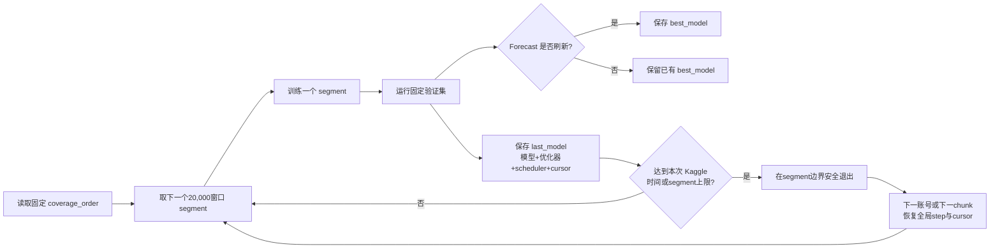

## 8. 训练结果与初步 OOS 证据

在独立 OOS 日期 2026-08-03 至 2026-08-10（6 个 signal dates，30,930 个窗口）上，Stage 2 checkpoint 相比原始底座取得以下结果：

| 模型 | 10 日方向准确率 | pooled Rank IC | 日均 Rank IC |
|---|---:|---:|---:|
| 原始 Kronos-small | 48.765% | -0.02248 | -0.03673 |
| Stage 2 best（segment 530） | 50.970% | 0.08651 | 0.08104 |
| Stage 2 last（segment 534） | 50.947% | 0.08627 | 0.08135 |

历史动量基线（10 日/20 日）方向准确率分别为 45.45%/38.98%，pooled Rank IC 为 -0.17906/-0.34855。十分位分组中，Stage 2 best/last 的 Top-minus-Bottom 平均约 +3.55%，原始底座约 -1.70%。这些结果只覆盖 6 个 OOS 日期，应作为初步证据，不能外推为长期稳定性或可交易性证明。

本文同时报告两种 Rank IC，定义必须区分：`pooled Rank IC` 将所有股票×signal-date 行拼接后计算一次 Spearman 相关；`daily Rank IC` 则先按 signal date 对当日横截面股票计算 Spearman，再对各日期的 IC 取平均。pooled 统计可能受各日期股票数量影响，因此不能替代 daily 统计；扩展 OOS 后还应报告每日期 IC、标准差、ICIR 和正 IC 比例。旧版 6 日期结果存在大量同日横截面和相邻日期相关性；扩展到 19 日期后，有效时间观测增加但仍不等同于 IID 样本。

### 8.1 Cosine C2 的独立 OOS 评估

Cosine refinement C2 完成后，使用与训练完全隔离的 OOS 包进行重新评估。评估范围为 2026-08-03 至 2026-08-10，共 6 个 signal dates、30,930 个股票窗口；每个模型使用同一 tokenizer、同一窗口集合、同一随机采样设置和同一自回归解码流程。C2 best 的实际 checkpoint 是 Cosine 阶段 Segment 179，C2 last 是 Segment 267；评估器输出中沿用了旧的 `best_segment_530`/`last_segment_534` 标签，不能据此误认为它们属于 Stage 2 Main。

| 模型 | D10 方向准确率 | pooled Rank IC | 日均 Rank IC | 正 IC 日期 | ICIR（按日） | Top-Bottom 10% 平均收益差 |
|---|---:|---:|---:|---:|---:|---:|
| 原始 Kronos-small | 48.765% | -0.0225 | -0.0367 | 1/6 | -0.83 | -1.71% |
| Stage 2 Main best | 50.970% | 0.0865 | 0.0810 | 6/6 | 2.46 | 3.55% |
| Stage 2 Main last | 50.947% | 0.0863 | 0.0813 | 6/6 | 2.48 | 3.55% |
| Cosine C2 best（Segment 179） | **54.455%** | **0.1569** | **0.1354** | **6/6** | 2.20 | **5.35%** |
| Cosine C2 last（Segment 267） | 54.336% | 0.1480 | 0.1244 | 6/6 | **2.30** | 5.04% |

其中，方向准确率表示预测收益与实际收益的涨跌符号相同的比例；Rank IC 表示模型预测排序与实际未来收益排序的 Spearman 相关；Top-Bottom 10% 是按预测分数选出的最高十分位与最低十分位的实际 D10 收益差。ICIR 在本表中定义为 6 个 signal-date 横截面 IC 的均值除以样本标准差，仅作描述性统计。

相对于 Stage 2 Main best，Cosine C2 best 的 D10 方向准确率提高约 3.49 个百分点，pooled Rank IC 从 0.0865 提高到 0.1569，日均 Rank IC 从 0.0810 提高到 0.1354，Top-Bottom 收益差从约 3.55% 提高到约 5.35%。原始模型和 10 日动量基线均为负 Rank IC；因此本次改善不是简单动量规则可以解释的。C2 last 略低于 C2 best，但仍保持相近的 OOS 排序能力，说明退火阶段的改善不是单个 checkpoint 的孤立异常。

这组结果支持以下有限结论：在当前数据快照和短 OOS 窗口下，Cosine refinement 后的模型比原始底座和 Stage 2 Main 表现出更强的横截面排序能力。它尚不能证明模型具有长期稳定 Alpha，也不能直接推出扣除手续费后的可交易收益。旧版 6 个 signal dates 仅能作为初步证据；新增日期虽将覆盖扩展至 19 个，D10 目标仍存在重叠，仍应继续扩展到至少 30、60 或 120 个 signal dates，并加入换手、交易成本、净收益、Sharpe 和最大回撤分析。

### 8.2 扩展 OOS：2026-08-11 至 2026-08-27

在原有 2026-08-03 至 2026-08-10 的 6 个 signal dates 之外，使用数据集 `A-share 120D Temporal Symbol Holdout` 中新增的全量 OOS 包进行扩展评估。新增区间覆盖 13 个 signal dates（2026-08-11、12、13、14、17、18、19、20、21、24、25、26、27），共 66,986 个窗口；三种模型使用完全相同的窗口集合、tokenizer 和自回归解码流程。OOS 仍不参与训练、scheduler 决策或 best checkpoint 选择。

| 模型 | 窗口数 | D10 方向准确率 | pooled Rank IC | 日均 Rank IC | 日 IC 标准差 | 正 IC 日期 |
|---|---:|---:|---:|---:|---:|---:|
| 原始 Kronos-small | 66,986 | 47.801% | 0.0256 | 0.0209 | 0.0306 | 8/13 |
| C2 best（Cosine Segment 179） | 66,986 | 48.697% | **0.1864** | **0.1741** | 0.0694 | **13/13** |
| C2 last（Cosine Segment 267） | 66,986 | 48.553% | 0.1822 | 0.1700 | 0.0666 | **13/13** |

新增 13 个日期上，C2 best/last 的 Rank IC 均显著高于原始底座，且每日横截面 IC 全部为正；但方向准确率仍接近 50%，说明主要改善体现为横截面排序而非逐股票涨跌命中率。C2 best 的 pooled Rank IC 仅比 C2 last 高约 0.004，二者差异不大，支持保留 best 与 last 两个 checkpoint 进行后续稳健性比较。

本次 Kaggle Kernel 的合并文件确认包含三个模型各 66,986 行、13 个 signal dates，共 200,958 行。Kernel 未生成 `summary.json`，但 `predictions.csv.gz` 完整可读；部分按日期的 C2 shard 出现缺失或零字节，因此汇总指标以合并预测文件为准，该导出问题必须在后续评估 Kernel 中修复并加入文件完整性断言。

将本次 13 个日期与旧的 6 个日期合并后，OOS 总覆盖应为 19 个 signal dates、97,916 个窗口/模型。由于日期之间的 D10 标签存在重叠，19 个日期仍不是 97,916 个 IID 观测；正式结论应同时报告逐日 IC、ICIR、正 IC 比例、Top-minus-Bottom、换手和交易成本，并继续扩展更长时间跨度后再决定是否进入 Stage 3 或追加训练预算。

评估产物与可复核日志如下：

- Kaggle Kernel：[smmt315/kronos-small-0-1-c2-alpha-oos-evaluation](https://www.kaggle.com/code/smmt315/kronos-small-0-1-c2-alpha-oos-evaluation)
- 本次扩展 OOS 本地汇总：[summary_local.json](/Users/fupengcheng/Documents/Kronos/artifacts/kronos_small_0_1_c2_alpha_oos_output_smmt315_20260914/kronos_small_0_1_stage2_oos/summary_local.json)
- 本次扩展 OOS 预测：[predictions.csv.gz](/Users/fupengcheng/Documents/Kronos/artifacts/kronos_small_0_1_c2_alpha_oos_output_smmt315_20260914/kronos_small_0_1_stage2_oos/predictions.csv.gz)
- 预测分片合并文件：[predictions.csv.gz](/Users/fupengcheng/Documents/Kronos/artifacts/kronos_small_0_1_c2_alpha_oos_output/kronos_small_0_1_stage2_oos/predictions.csv.gz)

验证 signal 结束于 2026-07-02，OOS signal 从 2026-08-03 开始，中间存在 2026-07-03 至 2026-08-02 的日历间隔。但当前 evaluation manifest 没有把这段间隔声明为专门设计的 31 日 embargo；更准确地说，OOS signal 紧接父模型最后训练目标日 2026-07-31 之后开始，成熟未来目标落在 2026-08-17 至 2026-08-24。论文中不应将该 gap 描述为 intentional embargo，除非后续实验固定并记录明确的 embargo 规则。

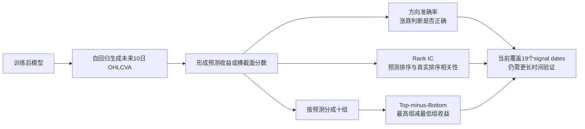

现阶段结果更像是在横截面排序上获得改善，而不是获得很高的逐股票涨跌命中率：

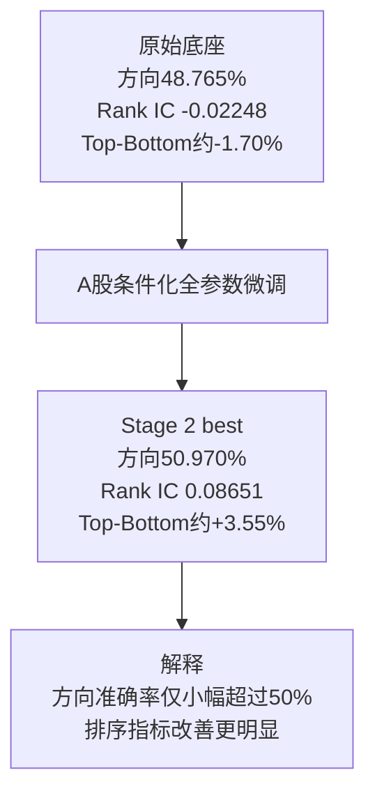

## 9. 训练健康性与解释边界

五段正式训练日志均显示 100% predictor 参数参与优化；因此当前 loss 改善缓慢不能归因于“主干被冻结”。Main 的全量验证 forecast 从 2.6384 降至约 2.5052，Extend 01 在 190 segments 内继续降至约 2.4379，WC first round 完整一轮后达到最佳约 2.3531，WC dual T4 再降至最佳约 2.3042。前两轮 WC 均未发散，但 dual T4 末段相对最佳值出现约 0.0026 的波动，为进入退火阶段提供了经验依据。

但“线性下降”不能单独证明模型没有吃饱，也不能证明学习率过小或金融信号已达到信息论上限。Cosine scheduler、窗口顺序、验证噪声和多步预测难度都会影响曲线形状。论文中应将 entropy floor、token 类别不平衡、层级 drift 等作为待检验假设，并使用权重位移、分 horizon loss 和预测分布熵等诊断提供证据。

### 9.1 Batch 噪声与优化速度的区分

Warmup-Constant 运行期间，dashboard 中的 raw `train/forecast_loss`、`train/loss` 和 `train/history_loss` 是 batch-level 指标。当前 batch size 为 64，而不同 batch 在股票、行业、市值、波动率、市场状态和历史窗口上差异很大，因此 train 曲线在约 2.2--2.7 区间高频抖动，不能直接用肉眼判断 `1e-5` 是否过小。

相反，固定的 123,836 个验证窗口提供了更低噪声的长期指标。WC first round 从 full/forecast `2.622678/2.437121` 降至 `2.559669/2.354255`，最佳 forecast 为 `2.353069`；WC dual T4 又从 `2.559856/2.355044` 降至 last 的 `2.522110/2.306788`，最佳 forecast 为 `2.304162`。这支持“统一 `1e-5` 在两轮完整 coverage 中持续推动优化”的判断，但仍不能证明它是单位计算量最优的学习率，也不能把末段波动直接等同于模型容量耗尽。

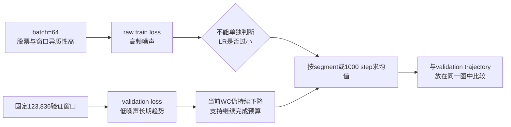

建议将训练指标按每个 segment（20,000 个窗口、约 312--313 个 batch）或每 1,000 个 optimizer step 聚合，额外记录：`train/forecast_loss_segment_mean`、`train/loss_segment_mean` 和 `train/history_loss_segment_mean`。聚合后若 train forecast 也下降，说明训练和验证趋势一致；若 train 长期横盘而 validation 继续下降，则应优先检查 train/validation 的 loss 定义、teacher forcing、dropout/eval 状态和 forecast 权重是否完全同构。

还必须核对 dashboard 中 `train/loss` 的精确定义：理论训练目标是 `weighted_forecast_loss + 0.02 * history_loss`，而 `forecast_loss` 可能是 weighted 或 raw/unweighted 统计。验证日志中的 `Validation Forecast` 已明确是原始 forecast NLL；训练指标若采用不同定义，不能直接用数值大小互相比较。

### 9.2 后续学习率探针

当前不应在已完成的 WC first round 结果之外擅自切换到 `2e-5` 或 `3e-5` 并将其混入本轮，否则会破坏“统一 `1e-5` 完整预算”这一核心实验。后续可从同一个完成 checkpoint 分叉出相同数据、相同验证集和相同预算的 LR probe：分别以 `1e-5`、`2e-5`、`3e-5` 运行固定数量的 segments，再比较 validation trajectory、best/last 和 OOS 指标。该设计才能区分“`1e-5` 合理但较慢”和“`1e-5` 确实过小”。

## 10. 导师评审意见与论文补强路线

导师评审认为，本方案的主要优点是数据规模、窗口内归一化、训练/验证隔离、完整 coverage 和 Kaggle 可复现接力流程；当前最需要补强的不是继续盲目扩大模型，而是回答“性能提升究竟来自哪里、在哪些市场状态下有效、能否稳定复现”。以下内容是论文补强建议，不是前五阶段已经完成的实验结果。

### 10.1 先明确 split protocol

论文不能只写“训练集和验证集隔离”，还应明确：源股票池 5,198 只股票按分层规则抽出 520 只验证股票和 4,678 只主要训练股票；520 只验证股票在 2024-12-31 前的历史仍可用于训练侧，2025-01-01 后的数据只用于验证侧；最终 516 只验证股票形成有效验证窗口。每个窗口还要说明 signal date、股票代码、lookback/forecast 边界如何决定其归属；验证期为 2025-07-03 至 2026-07-02，OOS 另取 2026-08-03 至 2026-08-10；标准化统计量只来自各自窗口的过去 120 日。还需要在最终论文中复核同一 signal date 附近的重叠窗口、行业统计和市值统计是否存在横截面信息泄漏，并报告数据快照和 manifest hash。

### 10.2 条件分支归因实验（最高优先级）

当前 OOS 提升同时包含“全参数 A 股微调”和“行业/市值条件”两个因素，尚不能证明提升单独来自条件信息。建议补充以下消融矩阵：

| 实验 | Sector | Size | Full FT | 要回答的问题 |
|---|---:|---:|---:|---|
| A | 关 | 关 | 开 | 纯 domain adaptation 的收益 |
| B | 开 | 关 | 开 | 行业条件的增量收益 |
| C | 关 | 开 | 开 | 市值条件的增量收益 |
| D | 开 | 开 | 开 | 完整 `small_0.1` |

同时建议比较 condition-only、最后两个 Transformer block + condition、全参数微调及 LoRA/adapter。由于条件在第 6 层后注入，这组实验可检验高层条件调制是否足够，还是必须重塑底层 token 表征。

这组 A/B/C/D 是下一阶段最关键的归因实验：它们不仅比较 loss，还要比较横截面 Rank IC、Top-minus-Bottom 和按 horizon 的方向指标，用来判断 OOS 提升究竟来自一般时序自回归微调，还是来自行业/市值条件所携带的金融横截面逻辑。换言之，消融实验是验证模型“确实学到金融排序关系”而不只是“在 A 股数据上继续拟合 token”的核心试金石。

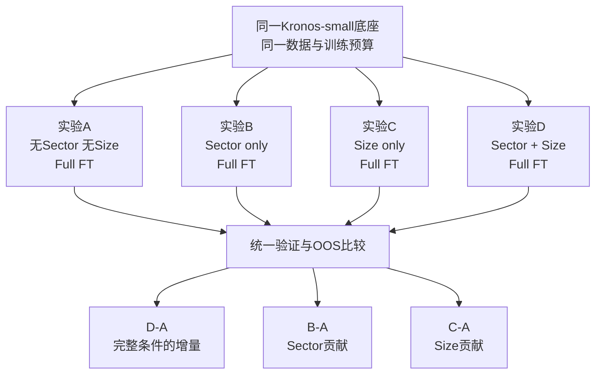

### 10.3 训练目标与金融评价对齐

当前训练优化的是加权 token NLL，而最终报告的是方向准确率、Rank IC 和 Top-minus-Bottom spread，两者之间存在 forecasting objective 到 financial metric 的间隔。建议按 horizon（至少 H1、H2、H3、H5、H7、H10）同时报告 loss、方向准确率和 Rank IC；并在后续实验中比较 token CE only、现有 `CE + 0.02 history`、return auxiliary 和 ranking auxiliary。现有 `return_head`/`barrier_head` 具备扩展基础，但正式范围内尚未启用。

### 10.4 Warmup-Constant 的公平比较

Extend 01 更换 coverage seed 的性质是 optimization continuation，而不是独立泛化实验。Warmup-Constant 的两轮 continuation 已分别完成 534 个 segments；但由于起点和 coverage seed 均不同，仍不能把它们与 cosine 结果当作严格的 scheduler A/B。严格比较应使用相同 checkpoint 起点、数据集合、batch、seed、验证集和 segment 预算，至少比较 100%、200% 和完整 coverage 的验证轨迹，再进行 OOS 比较。

已经完成的 `small_0.1_stage2_wc_last` 是本项目用于回答“Cosine 后期衰减是否过早限制优化”的直接实验。它保持统一峰值学习率 `1e-5`，warm-up 后不再衰减，且不改变 checkpoint 起点、loss、batch、数据集和验证定义；本次按计划使用新的 coverage seed `20260908`，因此它同时包含 scheduler 改变和窗口访问顺序改变两个因素，不能被表述为纯 scheduler A/B。完整 534/534 segments 后 validation forecast 最佳为 `2.353069`。其后的 `small_0.1_stage2_wc_dual_t4` 又完成一轮 534/534 segments，最佳 forecast 为 `2.304162`；这一 continuation 已在第 6.5 节单独报告。

在 WC first round 结束时，validation full loss 从 `2.622678` 降至 `2.559669`，forecast loss 从 `2.437121` 降至 `2.354255`，最佳 forecast 为 `2.353069`；WC dual T4 的最佳 forecast 进一步降至 `2.304162`。两轮曲线存在正常 batch/segment 抖动，第二轮末段开始围绕低值波动。该现象支持恒定学习率阶段继续优化过模型，但不等于已经证明 Constant 优于 Cosine，也不等于可以无限延长训练；因此下一阶段转为降低学习率的退火实验。

因此本实验的执行纪律是：训练完成前不改学习率、不切换 scheduler、不修改 loss 权重、不更换 batch 或 seed、不手动挑选中间 checkpoint。训练完成后统一比较：同一训练进度下的 validation trajectory、best/last checkpoint、最终是否仍有下降、以及独立 OOS 的方向准确率和 Rank IC。只有在相同预算或相同 coverage 进度下比较，才能区分“单纯继续训练的收益”和“Constant 学习率本身的收益”。从优化理论角度，本实验还可视为对 **River Valley 损失地形假说** 的探索：在 cosine 后期步长衰减可能把模型限制在浅层局部区域的假设下，warm-up 后保持较大的恒定步长，可能通过持续的随机梯度噪声（SGN）帮助参数离开浅层局部最优，并为最终的物理平台期退火提供依据。River Valley 和 SGN 在本项目中仍是待验证的解释性假说，不是已由当前曲线证明的机制。

### 10.5 OOS、统计稳定性与市场状态

当前 OOS 有 30,930 个窗口，但只有 6 个独立 signal dates；有效时间样本远小于窗口数量。因此现有 Rank IC=0.0865 只能称为短期初步证据。论文增强版应采用 walk-forward 评估，扩展到至少 30、60 或 120 个 signal dates，并报告 mean/median IC、IC 标准差、ICIR、正 IC 比例、Top-minus-Bottom spread 和 hit rate。进一步可按牛市、熊市、震荡、高波动、低波动状态分组，报告模型是否只在某一 regime 有效。

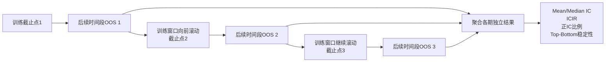

### 10.6 论文中的结论边界

在补充实验完成前，建议使用以下表述：“在当前短 OOS 窗口和给定数据快照下，A 股条件化全参数微调相较原始 Kronos-small 显示出方向准确率和横截面排序指标改善。”不应写成“模型已证明具有稳定 Alpha”或“改善必然来自行业/市值条件”。

## 11. 未完成实验与后续工作

### 11.1 Cosine refinement 退火已完成

两轮 Warmup-Constant 均已完成，WC dual T4 的正式结果见第 6.5 节。随后执行的 `small_0.1_stage2_cosine_refinement` 已完成 `267/267 segments`，退火阶段的正式结果见第 6.6 节：forecast 从 `2.306393` 降至 best `2.294402`，last 为 `2.295665`。因此本阶段已完成，不再使用“待执行”或“尚无结果”的表述。

建议在启动前预注册以下设置：

| 项目 | 退火阶段建议 | 控制理由 |
|---|---|---|
| 起点 | WC dual T4 checkpoint | 具体 best/last 选择规则需结合日志中的实际恢复路径记录 |
| 学习率 | 统一约 `1e-5` 退火至约 `1e-6` | 相对 constant `1e-5` 逐步降低更新噪声 |
| scheduler | `uniform_cosine`，无 warm-up | 日志实测配置；global plan 83,571 steps |
| optimizer | fresh AdamW | 将退火阶段与上一轮恒定 LR 的动量状态分离并明确记录 |
| coverage seed | 使用未出现过的新 seed | 改变窗口顺序，同时保留完整 coverage 规则 |
| batch | global 64 | 与 Main、Extend 和两轮 WC 保持一致 |
| 数据与 loss | 完全不变 | 使主要实验变量保持为学习率轨迹 |
| 验证与选模 | 全量 123,836；按 forecast 选 best | 保持跨阶段可比性 |
| 训练预算 | 267/267 segments，已完成 | 本轮结果可纳入论文，但不与 WC 阶段混为同一 scheduler |

退火阶段达成了预设的 loss 目标：best forecast 低于 WC dual T4 的 `2.304162`，且 267 个 segments 完成后仍保持在 `2.295665`。独立 OOS 已扩展至 19 个 signal dates（其中新增 13 个日期），新增区间上 C2 best 的 pooled Rank IC 为 `0.1864`、日均 Rank IC 为 `0.1741`，方向准确率为 `48.697%`，每日 IC 为正的日期为 13/13。该结果支持横截面排序能力具有一定跨日期稳定性，但仍不能替代更长时间窗口和交易成本口径下的稳定性检验。

### 11.2 其余后续实验

退火完成后，仍建议在相同起点、相同 seed、相同验证集和相同预算下做 cosine 与 constant 的公平比较；按 forecast horizon 分解验证 loss；比较初始底座与最终 checkpoint 的分层 relative weight drift；扩展 OOS 日期后再评估方向准确率、Rank IC、分组收益及统计显著性。

## 12. 可复核文件

- 模型定义：[model/kronos.py](/Users/fupengcheng/Documents/Kronos/model/kronos.py)、[model/module.py](/Users/fupengcheng/Documents/Kronos/model/module.py)
- 数据与窗口：[finetune/dataset.py](/Users/fupengcheng/Documents/Kronos/finetune/dataset.py)
- 训练与损失：[finetune/train_predictor.py](/Users/fupengcheng/Documents/Kronos/finetune/train_predictor.py)
- 配置：[finetune/config.py](/Users/fupengcheng/Documents/Kronos/finetune/config.py)
- 训练日志目录：`small_train_log/`；WC first round 完整日志：[small_0.1_stage2_wc_last-2026-9-9_23_24_00.log](/Users/fupengcheng/Documents/Kronos/small_train_log/small_0.1_stage2_wc_last-2026-9-9_23_24_00.log)；WC dual T4 完整日志：[small_0.1_stage2_wc_dual_t4-2026-9-12_18_47_04.log](/Users/fupengcheng/Documents/Kronos/small_train_log/small_0.1_stage2_wc_dual_t4-2026-9-12_18_47_04.log)
- Stage 2 Main OOS 汇总：[summary.json](/Users/fupengcheng/Documents/Kronos/artifacts/kronos_small_0_1_stage2_oos_base_kaggle/kronos_small_0_1_stage2_oos/summary.json)
- Cosine C2 OOS 汇总：[summary.json](/Users/fupengcheng/Documents/Kronos/artifacts/kronos_small_0_1_c2_alpha_oos_output/kronos_small_0_1_stage2_oos/summary.json)

本文以日志和当前代码为准；若历史计划文档与实测配置冲突，应优先引用本报告中的代码/日志事实，并在论文实验设置中注明具体 commit、seed、数据快照和 checkpoint 标识。
